# 🏥 Hospital Management Technology Platform (HMTP)

## Enterprise, Multi-Tenant, Cloud-Native Architecture

---

## 1. Purpose

This document defines the **end-to-end architecture** of the Hospital Management Technology Platform (HMTP).  
It is written to be **human-readable** and **AI-tool-friendly** (Cursor, GitHub Copilot, IDE agents, system-design tools).

The platform is designed as a **multi-hospital SaaS**, supporting clinical workflows, billing, compliance, and cloud-native scalability.

---

## 2. High-Level Architecture

### System Overview

- Frontend: Role-based dashboards (Next.js)
- Backend: FastAPI platform services
- Data: Tenant-isolated PostgreSQL
- Infra: Docker + Kubernetes + HPA
- Observability: Prometheus + Grafana

### Mermaid Diagram – High Level

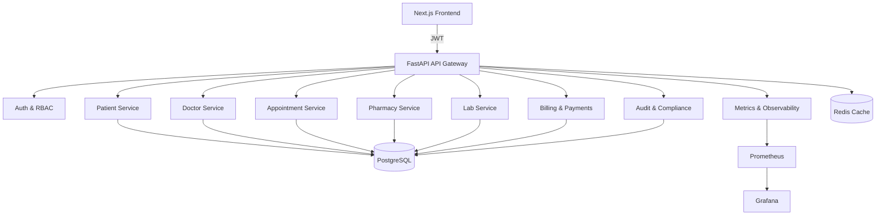

---

## 3. Architectural Principles

### Platform-First Design
- Shared authentication, audit, and observability
- Independent domain modules
- Consistent REST APIs

### Tenant Isolation
- Single database
- `hospital_id` enforced on all domain entities
- Query-level isolation

### Healthcare Compliance
- Audit trails
- Role-based access
- Immutable logs

---

## 4. Module Architecture

### Application Modules

- Auth & Identity
- Patient Management
- Doctor & Availability
- Appointment Scheduling
- Pharmacy
- Laboratory
- Billing & Payments
- Insurance Claims
- Audit & Compliance
- Observability & Metrics

### Mermaid Diagram – Module Layer

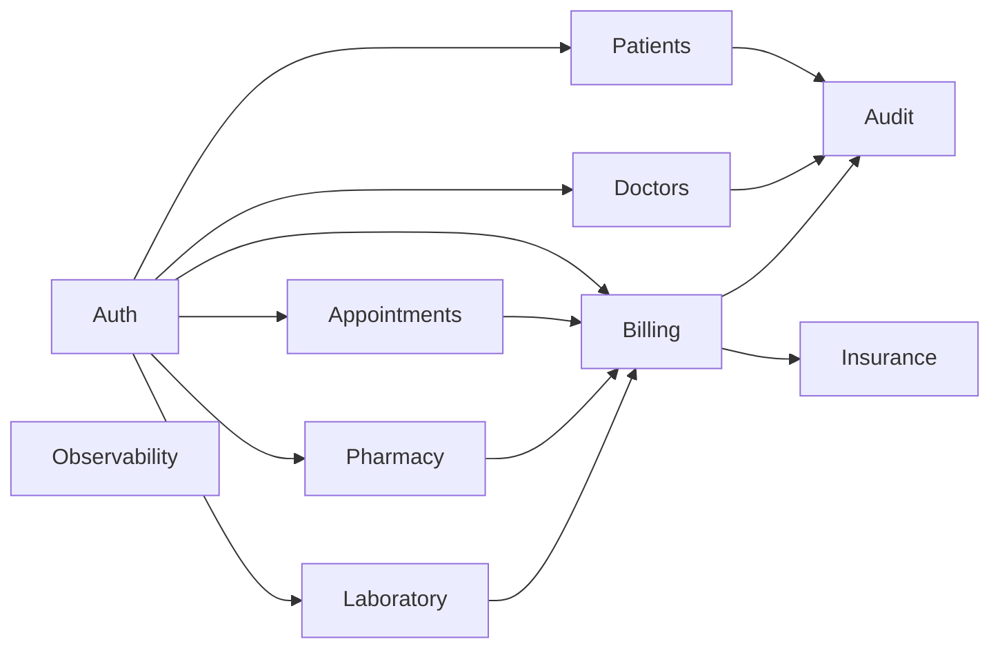

---

## 5. Multi-Tenant Architecture

### Tenant Strategy

- Single PostgreSQL database
- `hospital_id` column on all domain tables
- Hospital context embedded in JWT

### Tenant Enforcement Flow

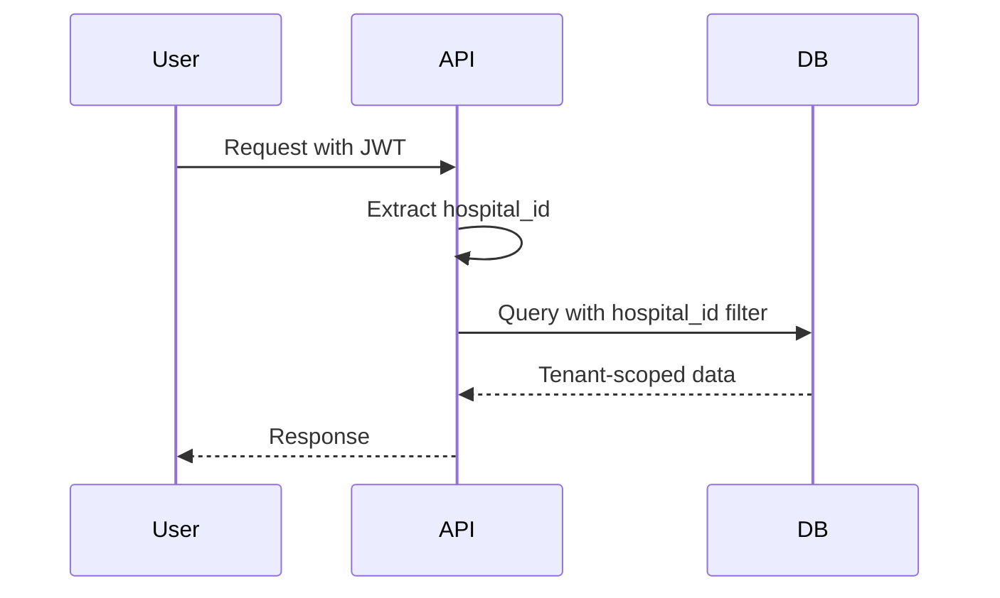

Guarantee: **No cross-hospital data leakage**.

---

## 6. Authentication & Authorization

### Auth Flow

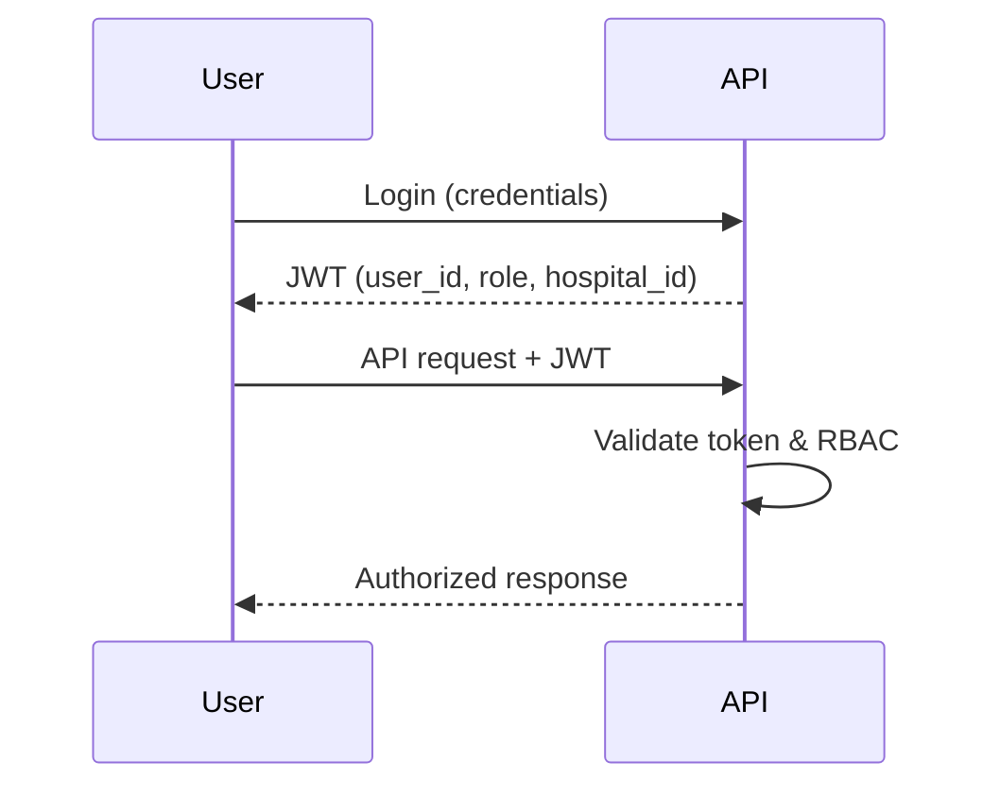

### Security Characteristics
- bcrypt password hashing
- 90-minute JWT expiration
- Dependency-based RBAC

---

## 7. Core Business Workflows

### OPD Workflow

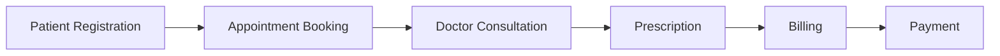

### Laboratory Workflow

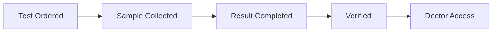

### Pharmacy Workflow

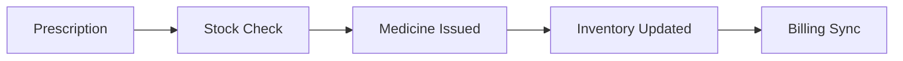

---

## 8. Audit & Compliance Architecture

### Audit Strategy
- Middleware-driven logging
- Immutable audit records
- Covers all sensitive operations

### Mermaid Diagram – Audit Flow

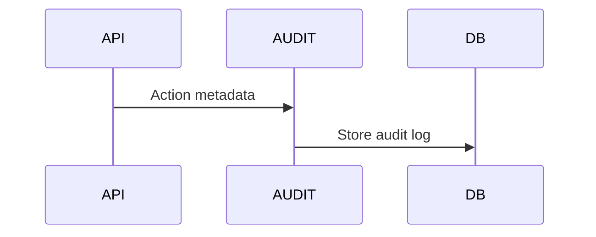

---

## 9. Observability & Monitoring

### Metrics Pipeline

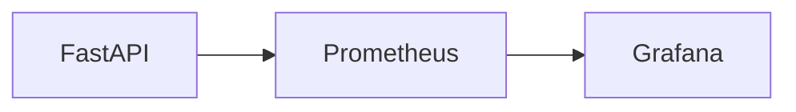

Metrics include:
- API latency
- Error rate
- OPD traffic
- Billing throughput

---

## 10. Deployment Architecture (Kubernetes)

### Cloud-Native Stack

- Docker containers
- Kubernetes deployments
- Horizontal Pod Autoscaler (HPA)

### Mermaid Diagram – K8s Deployment

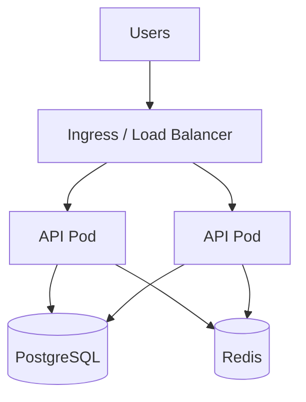

---

## 11. CI/CD Architecture

### Pipeline

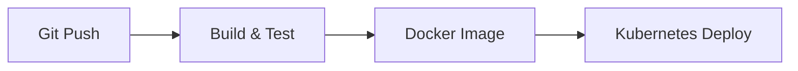

---

## 12. Repository Structure

```
hospital-platform/
├── backend/
│   ├── app/
│   │   ├── auth/
│   │   ├── patients/
│   │   ├── doctors/
│   │   ├── appointments/
│   │   ├── pharmacy/
│   │   ├── labs/
│   │   ├── billing/
│   │   ├── audit/
│   │   └── core/
│   └── main.py
├── frontend/
│   ├── pages/
│   ├── components/
│   └── services/
├── k8s/
├── docker-compose.yml
├── ARCHITECTURE.md
└── README.md
```

---

## 13. Final Architecture Statement

> HMTP is a **cloud-native, multi-tenant hospital management platform** designed with platform-first principles, healthcare compliance, and Kubernetes-based scalability, suitable for enterprise deployment and system design interviews.

